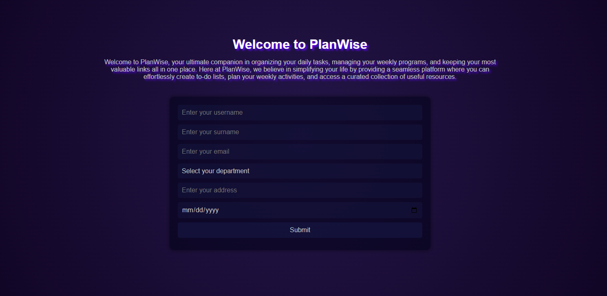
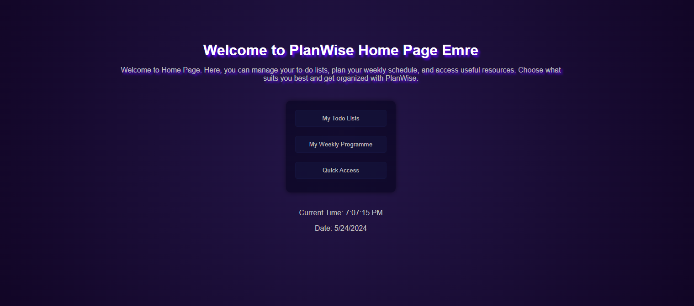
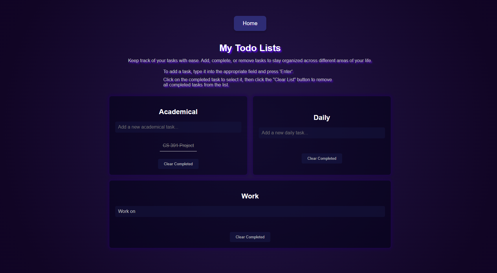
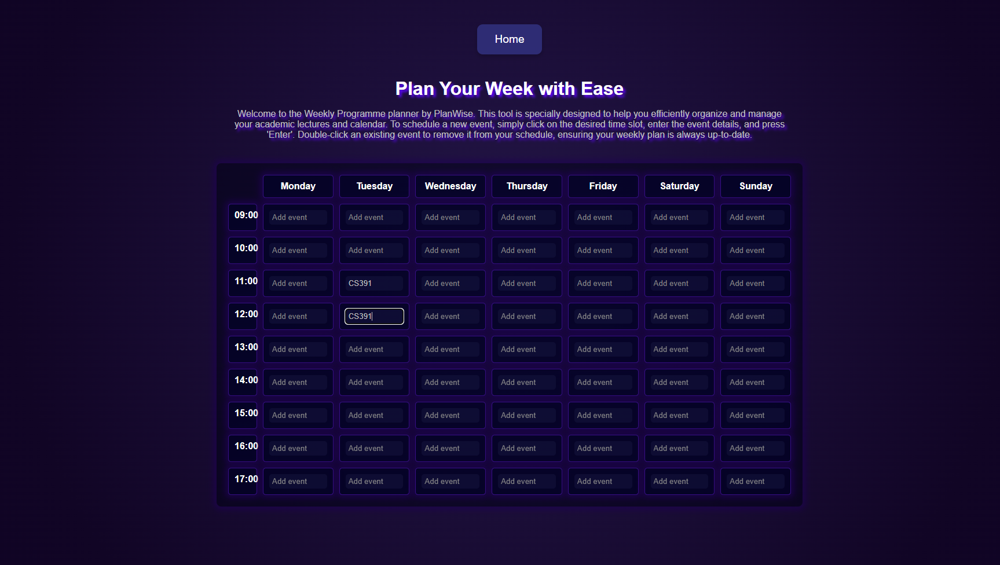
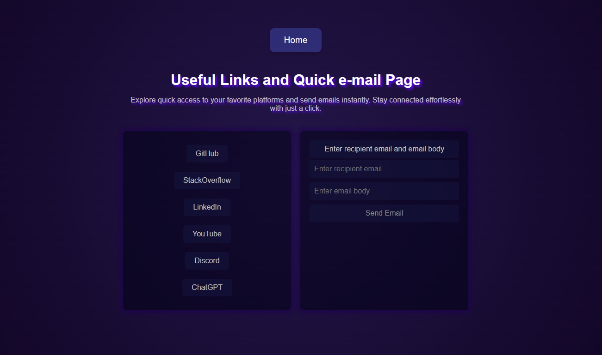
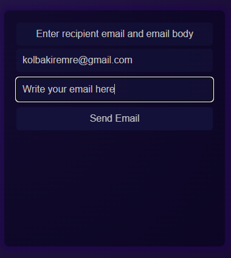
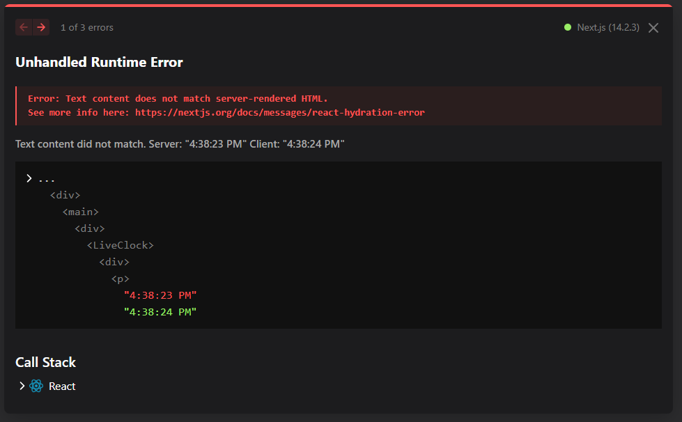
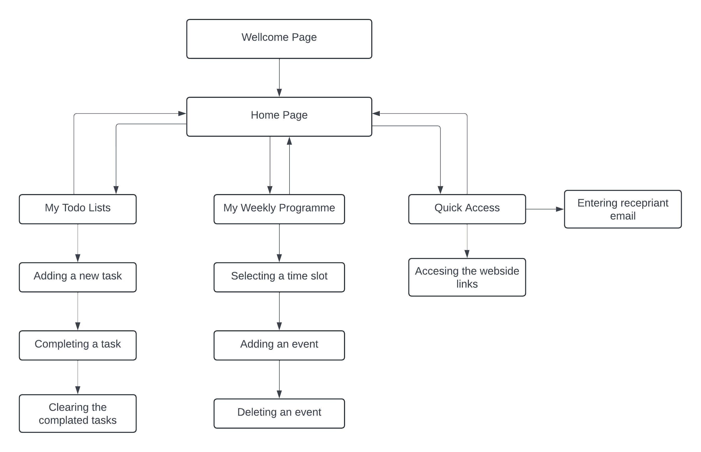

# 📅 PlanWise Web Application

## Overview

PlanWise is a web application designed to help users efficiently organize and manage their tasks and schedules. The application includes features such as to-do lists, a weekly planner, quick access to useful links, and email functionality.

## Table of Contents

- [Features](#features)
- [Installation](#installation)
- [Usage](#usage)
  - [Home Page](#home-page)
  - [To-Do Lists](#to-do-lists)
  - [Weekly Planner](#weekly-planner)
  - [Quick Access Links](#quick-access-links)
  - [Email Functionality](#email-functionality)
- [Technical Details](#technical-details)
- [Warning](#warning)
- [Contributing](#contributing)
- [License](#license)

## Features

- 📝 **To-Do Lists**: Manage your tasks with categorized to-do lists (Academical, Daily, Work).
- 📅 **Weekly Planner**: Plan your week with a detailed weekly schedule, add and remove events easily.
- 🔗 **Quick Access Links**: Access frequently used websites quickly.
- 📧 **Email Functionality**: Send emails directly from the application.

## Installation

1. **Clone the Repository**:
    ```sh
    git clone https://github.com/EmreKolbakir/CS391-P2-EmreKolbakir.git
    cd CS391-P2-EmreKolbakir
    ```

2. **Install Dependencies**:
    ```sh
    npm install
    ```

3. **Run the Application**:
    In one terminal, run the development server:
    ```sh
    npm run dev
    ```

4. **Run the JSON Server**:
    In a separate terminal, run the JSON server:
    ```sh
    json-server --watch db.json --port 5000
    ```

5. **Open in Browser**:
    Open your browser and go to `http://localhost:3000`.

## Usage

### Index Page (Sign Up or Information)

The index page allows users to sign up or provide their information.



- **Sign Up Form**: Users can enter their username, surname, email, department, address, and birth date.
- **Dropdown Menu**: Choose department from a dropdown menu.
- **Date Picker**: Select birth date using a date picker.
- **Submit Button**: Submit the form to proceed to the home page.

### Home Page

The home page is the central hub of PlanWise. It provides navigation to all major features.



- **Welcome Message**: Personalized welcome message based on the user's name.
- **Navigation**: Links to To-Do Lists, Weekly Program, Quick Access, and Email.

### To-Do Lists

Manage your tasks with categorized to-do lists.



- **Add Tasks**: Type in the task and press 'Enter' to add.
- **Mark as Complete**: Click on a task to mark it as complete.
- **Clear Completed Tasks**: Click the "Clear Completed" button to remove all completed tasks.

### Weekly Planner

Organize your week with the weekly planner.



- **Add Events**: Click on a time slot, enter the event details, and press 'Enter'.
- **Remove Events**: Double-click an existing event to remove it.

### Quick Access Links

Access frequently used websites quickly.



- **Links**: Buttons to navigate to websites like GitHub, StackOverflow, LinkedIn, YouTube, Discord, and ChatGPT.

### Email Functionality

Send emails directly from the application.



- **Send Email**: Enter the recipient email and message, then click 'Send'.

## Technical Details

- **Built with**: ReactJS, NextJS
- **Styling**: Custom CSS, Responsive Design
- **Data Management**: FetchAPI, RESTful Services

## Warning

If you encounter an error, please refresh the page. Here is an example of the error you might see:



## Page FLow Diagram


## Project Members and Responsibilities

- **Emre Kolbakir**: Responsible for the entire project, including front-end design, back-end functionality, and documentation.


## License

This project is licensed under the MIT License - see the [LICENSE](LICENSE) file for details.
